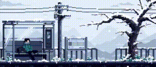

<h1 align="center">Hey there, I'm Raj Aryan 👋</h1>
<h3 align="center"> 💻 Future Full-Stack & Game Engine Dev</h3>

  

<

---

### 🔥 About Me

- **JavaScript**, **React**, **Node.js**, **DSA in C++**, and **Python for AI**
- Building a cross-platform **3D Game Engine** (OpenGL + Vulkan + C++)
-  I use Arch btw

---

### 🧰 Tech Stack

  
  

---

### 📊 GitHub Stats

  
   
  

---

### 📈 LeetCode Profile

- 🔗 [rajaryan24 on LeetCode](https://leetcode.com/rajaryan24/)

  

 Contribution 

how i can add that video animation.gig.mp4 in readme
